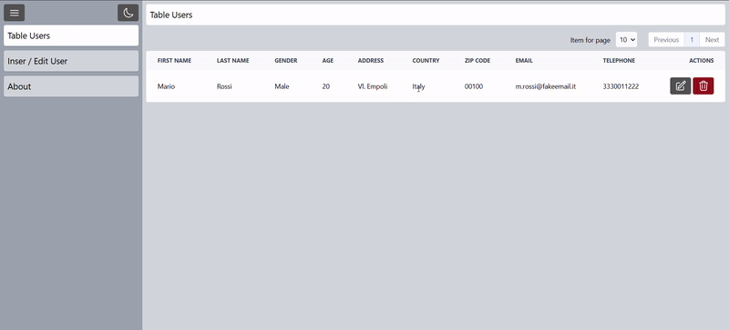

# Angular 19 CRUD Application

## Demo View


## About
This project is a simple CRUD (Create, Read, Update, Delete) application built entirely in Angular 19. It demonstrates fundamental operations for managing user data, providing an intuitive user interface and efficient interaction with a simulated backend.

## Features
- **User Table**: Displays a list of users with options to edit or delete each entry.
- **User Form**: Allows adding new users or modifying existing user details.
- **Frontend Only**: Simulates CRUD functionality without backend integration.
- **Modern Angular Framework**: Built with Angular 19 for optimal performance and scalability.
- **Tailwind CSS**: Utilized for responsive and modern styling.
- **Heroicons**: Integrated for consistent and elegant iconography.

## Requirements
- Node.js (version 22 or higher)
- Angular CLI (version 19 or higher)
- A modern web browser

## Installation
1. Clone the repository:
   ```bash
   git clone https://github.com/iDrako84/angular-19-crud-example.git
   ```
2. Navigate to the project directory:
   ```bash
   cd angular-crud-app
   ```
3. Install dependencies:
   ```bash
   npm install
   ```

## Running the Application
1. Start the development server:
   ```bash
   ng serve
   ```
2. Open your browser and navigate to:
   ```
   http://localhost:4200
   ```

## Usage
- View the user list in the table.
- Use the edit and delete buttons in the table to manage users.
- Add new users or update existing ones using the form.

## Development
Feel free to contribute by forking the repository and creating pull requests. Ensure your changes align with the project's goals and coding standards.

### Scripts
- **Start Dev Server**: `ng serve`
- **Build Project**: `ng build`

## License
This project is licensed under the MIT License. See the LICENSE file for details.

## Acknowledgments
Special thanks to the Angular community for providing resources and tools that made this project possible.

## Contact
For questions or feedback, please contact amici.massimiliano@ik.me.
